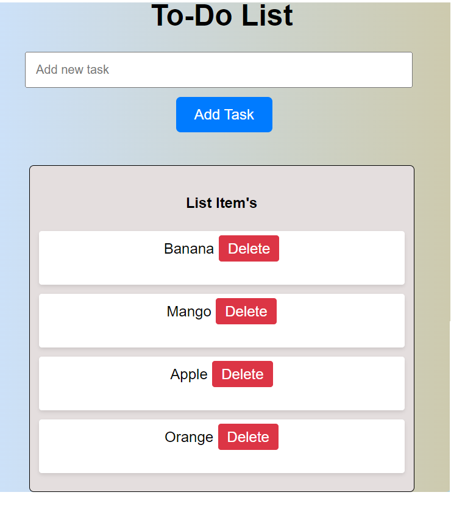

# Simple To-Do List

A simple to-do list web application built with HTML, CSS, and JavaScript.

## Description

This project is a basic to-do list application where users can add tasks, mark them as completed, and delete them. It demonstrates fundamental web development concepts using HTML for structure, CSS for styling, and JavaScript for interactivity.

## Features

- Add tasks: Users can add new tasks to the to-do list.
- Mark tasks as completed: Users can mark tasks as completed by clicking on them.
- Delete tasks: Users can delete tasks from the to-do list.
- Responsive design: The application is responsive and can be used on various screen sizes.

## Usage

1. Clone the repository:

    ```bash
    git clone https://github.com/your-username/simple-to-do-list.git
    ```

2. Open `index.html` in your web browser.

3. Start adding tasks to your to-do list!

## Screenshots




## Credits

This project was created by [Tariq Sheikh](https://github.com/Tariq-sheikh21).

## License

This project is licensed under the MIT License - see the [LICENSE](LICENSE) file for details.
